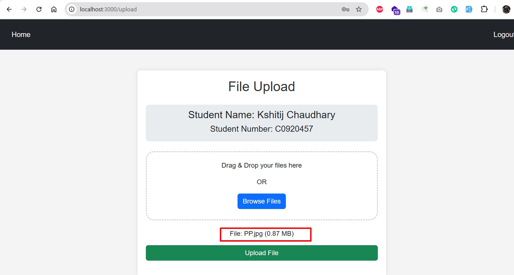

# Cloud Computing Project 1: AWS S3 File Upload System

## Project Overview
This project is a secure web application built with Node.js that allows users to upload files to an AWS S3 bucket. It features a professional user interface, user authentication, and seamless AWS S3 integration for managing file uploads.

## Technologies Used
- **Frontend**: HTML5, CSS3 (Bootstrap/Tailwind CSS/W3CSS), JavaScript
- **Backend**: Node.js, Express.js, AWS SDK for JavaScript, Multer (for file upload handling)
- **AWS Services**: S3, IAM (Identity and Access Management)

## Setup Instructions

### Prerequisites
Before starting, make sure you have the following installed:
- **Node.js** (version 14 or higher) – [Download Node.js](https://nodejs.org/)
- **npm** (Node Package Manager) – npm comes with Node.js
- **AWS Account** – You'll need an AWS account to set up the S3 bucket and IAM user for access.

## Deployment
### Local Deployment
The application can be deployed locally by following the setup instructions.
### 1. Clone the repository
First, clone the repository to your local machine:

`git clone https://github.com/your-username/aws-s3-file-upload.git`
`cd aws-s3-file-upload`


### 2. Install Dependencies
Navigate to the project directory and install the necessary dependencies by running:
`npm install`

### 3. Setup Environment Variables
Create a .env file in the root of the project directory and add the following environment variables:
- AWS_ACCESS_KEY_ID=your_aws_access_key_id
- AWS_SECRET_ACCESS_KEY=your_aws_secret_access_key
- AWS_BUCKET_NAME=your_s3_bucket_name
- AWS_REGION=your_aws_region
- SESSION_SECRET=your_session_secret_key 

### Required Environment Variables
- AWS_ACCESS_KEY_ID: Your AWS access key ID.
- AWS_SECRET_ACCESS_KEY: Your AWS secret access key.
- AWS_REGION: The region of your S3 bucket.
- AWS_BUCKET_NAME: The name of your S3 bucket.

### 4. Configure AWS S3
- Log into the AWS Management Console.
- Go to S3 and create a new bucket (or use an existing one) to store the uploaded files.
- Ensure that the IAM user you are using has the necessary permissions to upload to this S3 bucket.
- Attach the AmazonS3FullAccess policy to the IAM user for simplicity (or create a custom policy if needed).
- Make sure to note the Bucket Name and Region for your .env file.

### 5. Start the Server
Now you can start the application by running:

`npm run dev`
As we have used nodemon for running node application

### 6. Access the Application
Open a web browser and go to:
`http://localhost:3000`


# API Endpoints
## POST /upload
### Endpoints

#### 1. **Login API**
- **URL**: `/auth/login`  
- **Method**: `POST`  
- **Description**: Authenticates users with a username and PIN.  
- **Request Body**:  
  ```json
  {
    "username": "your-username",
    "pin": "your-pin"
  }

### Response:
#### Success:
{
  "success": true,
  "message": "Login successful"
}
#### Error:
{
  "error": "Invalid username or PIN"
}
## 2. File Upload API
URL: /upload
Method: POST
Description: Uploads a file to the configured AWS S3 bucket.
##### Headers:
Authorization: Bearer token (provided after login).
##### Request:
Form-data with key file containing the file to be uploaded.
Response:
Success:
{
  "success": true,
  "message": "File uploaded successfully"
}
Error:
{
  "error": "File upload failed. Please try again."
}

## Security Implementation Details
### Authentication
- User sessions are managed using a session-based authentication system.
- Secure login using predetermined credentials.
### AWS Credentials
- Managed securely using environment variables.
- No hard-coded credentials in the codebase.
### Input Validation
- Only files of type PDF, JPEG, and PNG are allowed.
- Maximum file size: 10MB.
### Error Handling
- Graceful handling for invalid file types and upload failures.

#### Creating Session key
`node -e "console.log(require('crypto').randomBytes(32).toString('hex'))"`

### AWS Configuration
We have to make sure that we have the correct AWS credentials and IAM permissions configured in our .env file. The application should work without further changes to AWS if your credentials are correct.

## Screenshots

1. **Main Application Interface**  
   

2. **Login Screen**  
   

3. **Successful File Upload Confirmation**  
   
    


4. **AWS S3 Bucket Showing Uploaded Files**  
   

5. **AWS IAM Configuration for Access Keys and Policies**  
   
   

5. **Error Handling**  
   
   


## ⚙️ Additional Configuration Steps

1. **AWS S3 Bucket Setup**:
   - Create an S3 bucket in your AWS account.
   - Enable public access if needed or configure specific access policies.
   - Note the bucket name and region for environment variables.

2. **AWS IAM Role and Policies**:
   - Create an IAM user with programmatic access.
   - Attach the following policy to allow file uploads:
     ```json
     {
       "Version": "2012-10-17",
       "Statement": [
         {
           "Effect": "Allow",
           "Action": "s3:PutObject",
           "Resource": "arn:aws:s3:::your-bucket-name/*"
         }
       ]
     }
     ```
   - Save the access key and secret key for environment variables.

3. **Environment Variables**:
   - Create a `.env` file in the root of your project with the following keys:
     ```
     AWS_ACCESS_KEY_ID=your-access-key-id
     AWS_SECRET_ACCESS_KEY=your-secret-access-key
     AWS_REGION=your-region
     AWS_BUCKET_NAME=your-bucket-name
     SESSION_SECRET=your-session-secret
     ```
   - Replace the placeholders with your actual credentials and configurations.

4. **Node.js Dependencies**:
   - Install all required dependencies:
     ```bash
     npm install
     ```

5. **Start the Application**:
   - Run the application locally:
     ```bash
     npm start
     ```
   - The server will start on the specified port (default is `3000`).

6. **Testing the Application**:
   - Access the application in your browser at `http://localhost:3000`.
   - Test login, file upload, and error handling to ensure everything works as expected.


